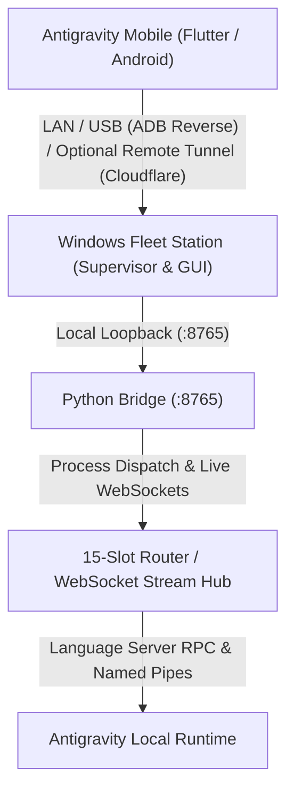

<p align="center">
  
</p>

# Antigravity Mobile & Windows Fleet Station: The Definitive Visual Guide

This guide provides comprehensive, side-by-side visual walkthroughs for both the **Windows Fleet Command Station** and the **Android Mobile Companion**, utilizing the project's visual assets and live captures.
A full video demonstration is also available: [**Watch Demo.mp4**](assets/Demo.mp4).

---

## 1. System Architecture & Dual-Platform Pipeline

Antigravity is designed as a local-first control plane and execution station. The Windows host acts as the local orchestration and execution station, while the Android mobile companion provides a native, low-latency control surface over local Wi-Fi, USB reverse tunneling (ADB), or optional Cloudflare remote tunnels.

The application has **no persistent application backend or cloud datastore**; all chat sessions, project files, and slot settings remain exclusively on your local host. Cloudflare Quick Tunnels act strictly as an optional, ephemeral transport layer for remote access.



---

## 2. Windows Fleet Command Station

The Windows Fleet Station coordinates up to 15 concurrent developer accounts with isolated OS profile directories per slot, local process supervision, and automated port tunneling.

### 2.1 Fleet Command Dashboard & Slot Matrix

The dashboard displays the live operational status of all 15 slots, background bridge gateway metrics, and instant spawn controls.


#### Key Dashboard Capabilities:
- **Real-Time Gateway Status**: Displays `GATEWAY ONLINE (:8765)` with one-click LAN IP copy and firewall verification.
- **Worker Slot Matrix (#01 - #15)**: Displays slot alias, bound developer email, dedicated local port (`53001` - `53015`), and worker lifecycle state (`IDLE`, `ACTIVE`, `UNLINKED`).
- **Profile Sandboxing**: Each account operates in its own isolated user directory (`~/.antigravity-fleet/profile_XX/`), ensuring total session independence.
- **Batch Dispatch Controls**:
  - `Spawn All (15)`: Concurrently spins up language server workers across all configured slots.
  - `Kill All`: Instantly terminates background worker processes in case of runaway tasks.

---

### 2.2 Mobile Pairing & Remote Connectivity

Connecting your Android phone to the Windows station offers three zero-friction connection modes.


#### Connection Modes:
1. **Local Wi-Fi Network**: Both devices connect to the same wireless LAN (`192.168.0.101:8765`). The QR code encodes host and token for instant handshake.
2. **Automated ADB USB Tunneling**: Station continuously enforces `adb reverse tcp:8765 tcp:8765`, enabling high-speed `127.0.0.1:8765` direct USB communication.
3. **Worldwide Remote (4G / Anywhere)**: Built-in Cloudflare quick tunnel support (`trycloudflare.com`) allows secure access to your home workstation from cellular data anywhere in the world.

---

### 2.3 Account Authentication & Profile Isolation

Slots can be authenticated individually through isolated Chromium browser instances or direct account tokens.


- **Method A: Direct Google Account Sign-In**: Launches an isolated browser window linked to `~/.antigravity-fleet/profile_XX` with zero shared cookies.
- **Method B: Direct Account Binding**: Bind existing Google account email and custom worker alias directly to the slot.

---

## 3. Android Mobile Companion

The mobile app delivers full parity with the desktop Antigravity IDE, engineered with dark-mode optimization and Material Design standards.

### 3.1 Streamlined Onboarding & Monochrome Navigation

The companion integrates fast QR-based onboarding and clean monochrome hierarchy in all drawers and project lists.

````carousel

<!-- slide -->

````

- **1-Time Scan Onboarding**: Tap **Scan Station QR Code** to point camera at the Windows station or tap **Direct Connect (USB / 127.0.0.1)**.
- **Monochrome Folder Glyphs**: Sidebar drawer project trees now use subtle monochrome folder icons matching the dark theme.

---

### 3.2 Real-Time Quota & Rolling Demand Limit Tracking

Eliminate quota surprises with live upstream inspection directly from Antigravity's `RetrieveUserQuotaSummary` service.

#### Live Quota Indicators:
- **5-Hour Rolling Demand-Smoothing Limit**: Color-coded progress bar (Green >50%, Amber 20-50%, Red <20%) with exact refresh countdowns (e.g., `Refreshes in 1 hour, 10 minutes`).
- **Weekly Tier Allowance**: Precise accounting of remaining weekly requests with exact reset countdowns.
- **Granular Group Separation**: Distinct quota tracking for Google Gemini models versus third-party models (Claude 4.6 Opus/Sonnet, GPT-OSS).

---

### 3.3 Dynamic Upstream RPC Model Discovery

The mobile app queries the live Antigravity Language Server RPC (`GetUserStatus`) to detect every model currently supported by your host installation.

- **Gemini Family**: `Gemini 3.8 Flash High` (Default), `Gemini 3.7 Flash` (High/Medium/Low), `Gemini 3.6 Flash`, and `Gemini 3.1 Pro Low`.
- **Third-Party Reasoning Models**: `Claude Sonnet 4.6 (Thinking)`, `Claude Opus 4.6 (Thinking)`, and `GPT-OSS 120B`.
- **In-Row Quota Previews**: Instant remaining percentage visibility next to each model.

---

### 3.4 Live Chat, Accurate Unified Diffs & Execution Trees

Inspect code generation in real time with desktop-grade syntax highlighting, multi-file diff cards, and transparent execution traces.

````carousel

<!-- slide -->

<!-- slide -->

<!-- slide -->

````

- **Unified Diff Engine**: Computes exact diffs (`difflib.unified_diff`) between consecutive file versions. Zero fake line counts, zero bloated additions, and redundant `+0` / `-0` tags are automatically suppressed.
- **Multi-File Diff Card**: Shows files changed with line additions (`+88`) and deletions (`-16`), language-specific icons (Python, Flutter/Dart), and a **Review** action button for full-screen side-by-side inspection.
- **Collapsible Command Execution Tree**: Tap to expand commands executed on the host (`Ran adb shell...`, `Type math prompt finished`, etc.).
- **Live Thinking Trace**: Deep reasoning thoughts render in collapsible bubbles matching the official IDE.

---

### 3.5 Live Background Tasks & Monospace Terminal Inspector

Never wonder if a long-running command, test suite, or background process is still active on your workstation.

````carousel

<!-- slide -->

````

- **Desktop-to-Mobile Task Parity**: A clean monochrome banner right above the prompt composer displays active background tasks with rotating progress indicators, matching Antigravity PC IDE down to the pixel.
- **Interactive Monospace Terminal Inspector**: Tap the terminal icon on any running task to open an on-screen bottom sheet with live streaming stdout/stderr logs.
- **Strict Conversation Scoping**: Tasks are strictly isolated to the conversation that initiated them. Idle chats never show false running animations or ghost badges.

---

### 3.6 Workspace Hub with Monochrome Project Tree & On-Device Creation

Full parity with desktop workspace organization directly from your Android phone.

````carousel

<!-- slide -->

<!-- slide -->

<!-- slide -->

````

- **Monochrome Folder Glyphs in Explorer**: Directories (`bridge`, `flutter_app`, `tests`, `tools_and_scripts`) render with sleek monochrome icons.
- **On-Device Directory Creation**: Enter project name and workspace folder path (e.g. `C:\Projects\my-app`) to spin up new workspaces on your host PC remotely.
- **Top AppBar Switcher**: Tap the active project title in the top bar to switch workspaces instantly.

---

### 3.7 15-Fleet Routing, Skills Catalog & Legal Transparency

Control multi-slot routing policies, toggle agent skills, and review compliance documentation.

````carousel

<!-- slide -->

<!-- slide -->

````

- **Routing Policies**:
  - **Single Dedicated**: Pin execution to a specific slot (`#01` to `#15`).
  - **Quota Pool**: Automatically failover to the next registered slot when quota drops.
  - **15x Swarm**: Parallel dispatch across all active workers.
- **Skills & Prompts Catalog**: Toggle builtin agent skills (`agy-customizations`, `antigravity-guide`, `generative_ui`) with active switches.
- **Legal & Disclaimer Notice**: Features Lead Developer attribution (Moh Gomaa, GitHub, LinkedIn) and clear nominative fair use compliance notices.

---

### 3.8 Autonomous Auto-Proceed Architecture (Zero-Block)

To prevent remote workflows and mobile sessions from freezing when Antigravity encounters ambiguous implementation decisions:
- **Zero-Block Directive**: All prompts dispatched via the Python bridge automatically enforce the `<AUTONOMOUS_EXECUTION_DIRECTIVE>`, instructing the agent to never call interactive modal tools (`ask_question`).
- **Autonomous Decision Making**: When multiple reasonable approaches exist, the agent selects the recommended path, implements it completely, and documents the rationale in its final markdown response.
- **Fail-Safe Client Auto-Proceed**: If a legacy question card is encountered, the mobile client displays an auto-proceed countdown timer (15 seconds) with a one-tap **"Auto-Proceed (Recommended)"** button. Touching an option pauses the timer for manual control, while unattended sessions automatically proceed with the recommended choice.

---

## 4. Setup & Deployment Quick Reference

### 4.1 First-Time Quick Start

```powershell
# Step 1: Launch Windows Fleet Station
# (Automatically starts background bridge on port 8765 and opens desktop station)
.\run.bat
# Or install via installer: Antigravity-FleetStation-Setup-v1.0.4.exe

# Step 2: Install Android Companion APK on your phone
adb install -r .\Antigravity-Fleet-Mobile-v1.0.4.apk
# (Or transfer Antigravity-Mobile-Latest.apk to your phone and install)

# Step 3 (Optional - High Speed USB Tunneling):
adb reverse tcp:8765 tcp:8765
```

### 4.2 Security & Privacy Model

| Security Dimension | Technical Mechanism & Implementation |
| :--- | :--- |
| **Local-First Architecture** | No persistent application backend or cloud datastore. History, settings, and workspaces are stored exclusively on the host PC. |
| **Transport Options** | Operates over local Wi-Fi (`192.168.x.x:8765`) or USB reverse tunnel (`adb reverse tcp:8765 tcp:8765`). Optional Cloudflare tunnels serve strictly as an ephemeral transport mechanism. |
| **Token Authentication** | Bridge endpoints enforce dynamic bearer authentication tokens (`x-bridge-token`), validated on every HTTP and WebSocket frame. |
| **Profile Partitioning** | Chromium user directories (`~/.antigravity-fleet/profile_01..15`) isolate session cookies, browser caches, and local databases per account slot. |
| **Runtime Compliance** | Integrates non-invasively with Antigravity via standard Language Server Connect protocol and Named Pipes without modifying upstream binaries. |
