<p align="center">
  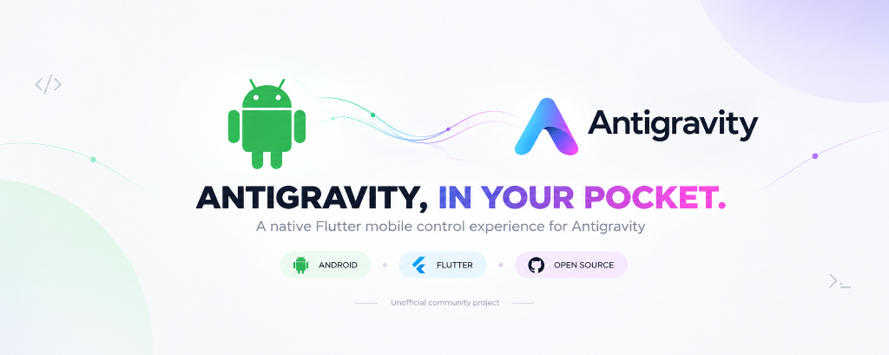
</p>

# Antigravity Mobile

**An unofficial, local-first Flutter/Android control plane for Antigravity, backed by a Windows Fleet Station for local execution, orchestration, and multi-slot management, with LAN/USB connectivity and optional remote tunneling.**

[](https://github.com/mohgomaa-art/antigravity-mobile/releases)
[](https://github.com/mohgomaa-art/antigravity-mobile)
[](DISCLAIMER.md)
[](LICENSE)

---

> [!IMPORTANT]
> **Unofficial Community Companion Project**
> This software is an independent, open-source personal research utility and developer companion. It is **NOT** an official Google product and is **NOT** affiliated with, sponsored by, or endorsed by Google LLC, Alphabet Inc., or any of their subsidiaries.
>
> All product names, logos, and brands (including "Google", "Antigravity", "Gemini", "Android", "Anthropic", "Claude", and "OpenAI") are property of their respective owners. Their use herein is strictly for descriptive identification under Nominative Fair Use. See [DISCLAIMER.md](DISCLAIMER.md) and [LICENSE](LICENSE).

---

## Video Demonstration

<p align="center">
  <a href="https://github.com/mohgomaa-art/antigravity-mobile/raw/master/assets/Demo.mp4">
    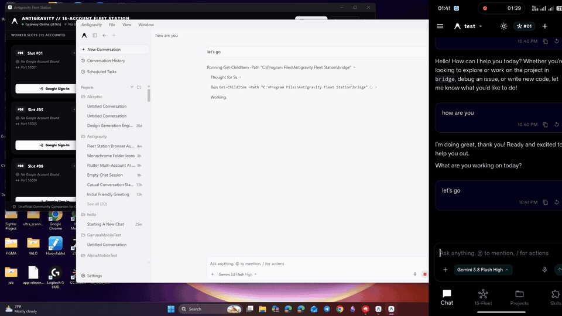
  </a>
</p>

> **[Watch Full HD Walkthrough (Demo.mp4)](https://github.com/mohgomaa-art/antigravity-mobile/raw/master/assets/Demo.mp4)** &nbsp;|&nbsp; [Direct HD Download (v1.0.4 Release)](https://github.com/mohgomaa-art/antigravity-mobile/releases/download/v1.0.4/Demo.mp4)

---

> **Complete Visual Documentation**: See the [Visual Field Guide](GUIDE.md) for full screenshots and walkthroughs of both the Windows Fleet Station and Android Companion.

---

## Strict Policy on Abuse & Responsible Use

> [!WARNING]
> **Adherence to Terms of Service & Anti-Abuse Guidelines**
>
> 1. **Personal Quota Management Only**: The multi-account orchestration architecture is engineered exclusively for developers managing their own legally registered, personal or organizational Google accounts to distribute legitimate development workloads without hitting personal rate limits.
> 2. **Prohibition of Mass Scraping & Botting**: This software must **never** be used for automated mass-scraping, botting, distributed denial of service (DoS), credential harvesting, or bypassing security controls.
> 3. **Local Authentication Privacy**: Credentials and OAuth session tokens are stored exclusively on the developer's local machine in isolated OS profile directories (`~/.antigravity-fleet/profile_XX/`). No tokens, code, prompt data, or session cookies are ever transmitted to any third-party cloud server or external telemetry aggregator.
> 4. **Compliance Responsibility**: Users are solely responsible for ensuring their usage complies with Google's Terms of Service, Generative AI Prohibited Use Policy, and applicable local regulations.

---

## Architectural Overview

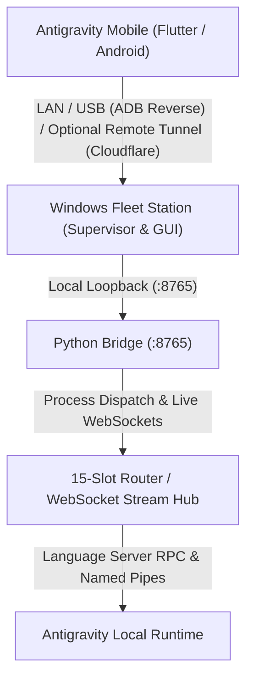

> [!NOTE]
> ### Data Storage & Transport Architecture
> The application has **no persistent application backend or cloud datastore**. All conversation history, workspace trees, diffs, and settings are stored locally on the host machine. Cloudflare Quick Tunnels act strictly as an **optional, ephemeral transport layer** for encrypted remote access when connecting outside your local network, without requiring persistent cloud infrastructure or firewall port forwarding.

---

## Feature Tour

### 1. Real-Time API Credits & Quota Monitoring
Never guess when your API credits will deplete or when you can resume coding. The companion connects directly to Antigravity's internal `RetrieveUserQuotaSummary` service to display:
- **5-Hour Rolling Demand-Smoothing Limit**: Color-coded progress bar (Green >50%, Amber 20-50%, Red <20%) with exact refresh countdowns (e.g. `Refreshes in 1 hour, 10 minutes`).
- **Weekly Individual Tier Limit**: Full accounting of weekly allowance with refresh countdowns (e.g. `Refreshes in 6 days, 12 hours`).
- **Granular Group Separation**: Distinct tracking for Gemini Models (Flash & Pro) versus Third-Party Models (Claude Opus, Claude Sonnet, GPT-OSS).

---

### 2. Official Upstream Model Discovery
Zero hardcoded model catalogs and zero random guesses. The bridge queries the active Antigravity Language Server RPC (`GetUserStatus`) to fetch the exact, live models supported by your installed version:
- **Primary Models**:
  - `Gemini 3.8 Flash High` (Default)
  - `Gemini 3.7 Flash Medium` (with High/Medium/Low sub-tiers)
  - `Gemini 3.6 Flash Medium` (Fast tier badge)
  - `Gemini 3.1 Pro Low` (Deep reasoning tier)
  - `Claude Sonnet 4.6 (Thinking)`
  - `Claude Opus 4.6 (Thinking)`
  - `GPT-OSS 120B (Medium)`
- **Dynamic Quota Preview**: Instant remaining quota percentage displayed directly on the `View Usage` row.

---

### 3. Syntax-Colored Unified Diffs & Native Markdown Viewer
Track code modifications and project walkthroughs on mobile with desktop-grade fidelity:
- **Unified Diff Engine**: Computes exact diffs (`difflib.unified_diff`) between consecutive file versions. Zero fake line counts, zero bloated additions, and redundant `+0` / `-0` tags are automatically suppressed.
- **Accurate Step-by-Step Badges**: Net additions formatted in terminal green (`#10B981`) and deletions in terminal red (`#EF4444`) with instant per-file review modals.
- **Rich Markdown & Plan Artifacts**: Tap any generated `.md`, `.plan`, or walkthrough link to inspect rich formatted output or toggle directly to raw code.

````carousel
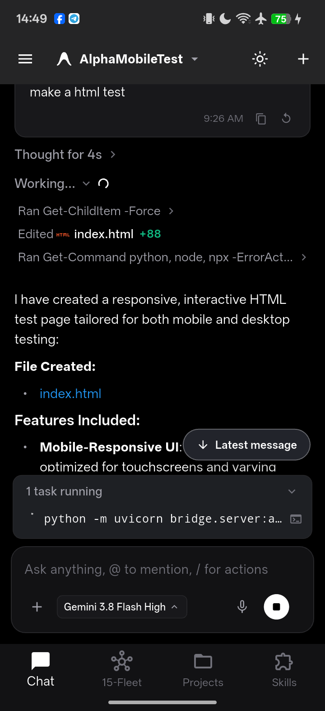
<!-- slide -->
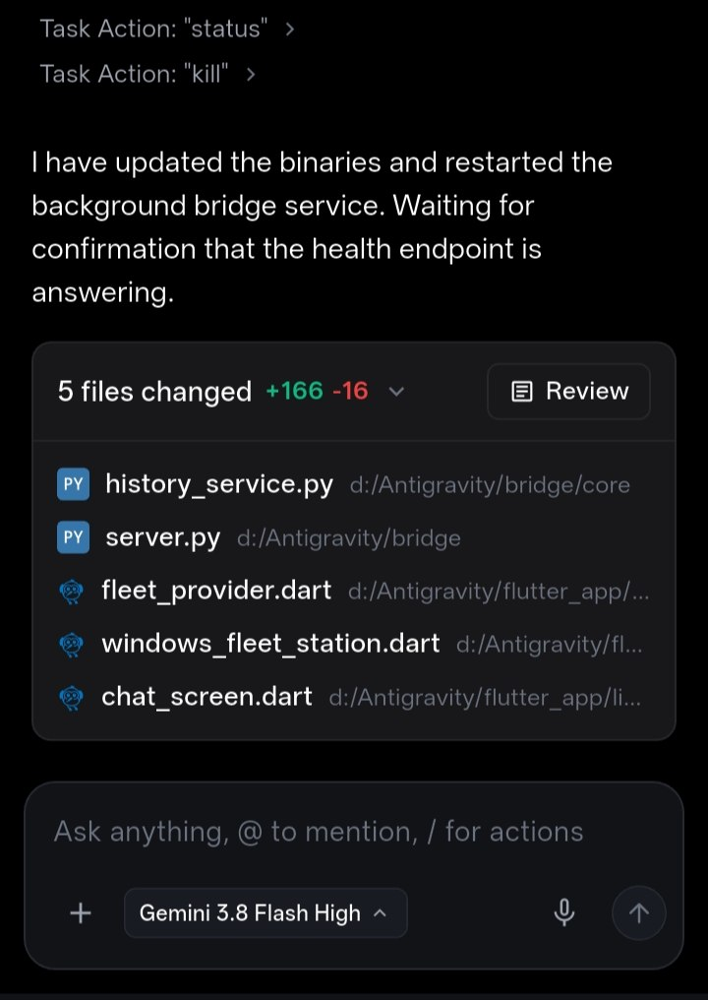
<!-- slide -->
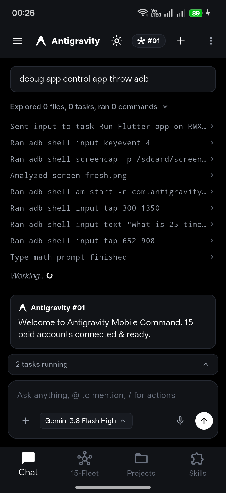
````

---

### 4. Live Running Background Tasks & Interactive Terminal Inspector
Never wonder if a long-running command or test is still active:
- **Desktop-to-Mobile Task Parity**: A clean monochrome banner right above the prompt composer displays active background tasks with rotating progress indicators, matching Antigravity PC IDE down to the pixel.
- **Interactive Terminal Viewer**: Tap the terminal icon on any running task to open an on-screen bottom sheet with live streaming stdout/stderr logs.
- **Conversation Scoping**: Background tasks are strictly bound to their parent conversation, ensuring zero noise or false working states in idle chats.

````carousel

<!-- slide -->
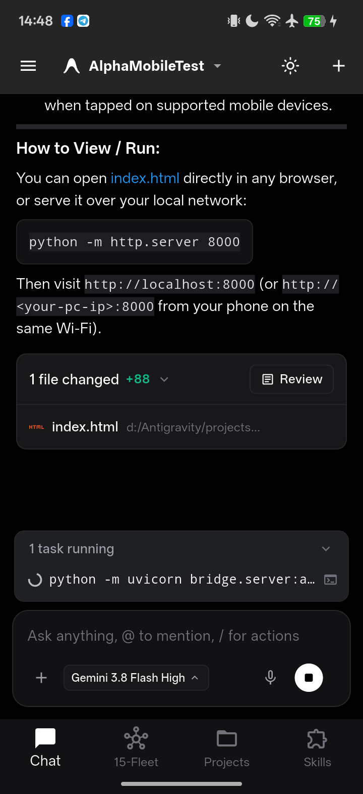
````

---

### 5. Fast One-Time Mobile Pairing & Onboarding
Seamless onboarding with automated network resolution:
- **1-Time Scan**: Point mobile camera at the Windows Fleet Station QR code.
- **Direct USB Connect**: Instant fallback over ADB reverse tunnel (`127.0.0.1:8765`).

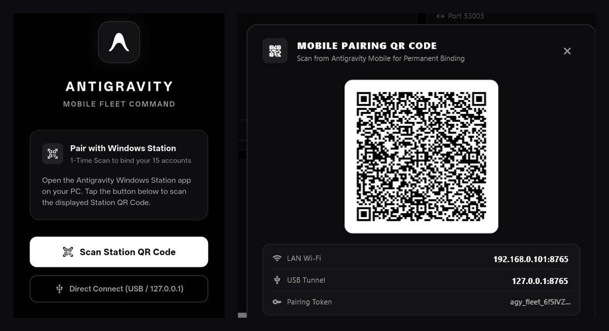

---

### 6. Multi-Project Management & On-Device Workspace Creation
Full parity with desktop workspace organization directly from your Android phone:
- **Dedicated Projects Tab**: Browse active project workspaces, total conversation history, and jump into chats.
- **On-Device Project Creation**: Create new projects on your host PC directly from mobile with custom names and folder paths.
- **Top AppBar Switcher**: Tap the project header in any chat to switch active workspaces without leaving the conversation view.

````carousel
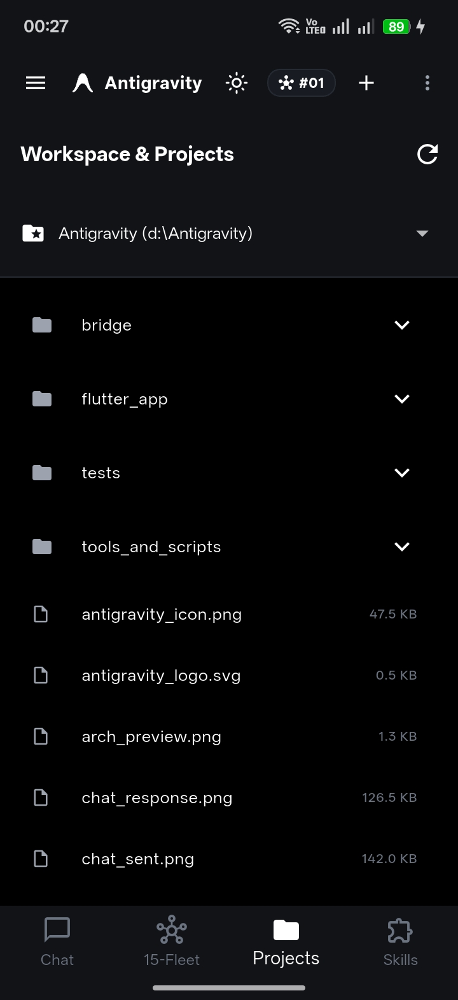
<!-- slide -->

<!-- slide -->

<!-- slide -->

````

---

### 7. Windows 15-Account Fleet Station
A command center for managing multi-account slots:
- **Isolated User Profiles**: Each account operates in its own isolated user profile directory (`~/.antigravity-fleet/profile_01..15`), maintaining partitioned browser cookies, cache, and local storage per slot.
- **Routing Policies**:
  - **Single Dedicated**: Pin execution to a specific slot.
  - **Quota Failover**: Automatically switch to the next registered slot when rate limits are approached.
  - **15x Swarm**: Parallel dispatch across multiple workers for massive code audits.
- **One-Click Mobile Pairing**: Integrated high-contrast QR code display and Cloudflare quick tunnels for instant local or remote phone binding.

````carousel
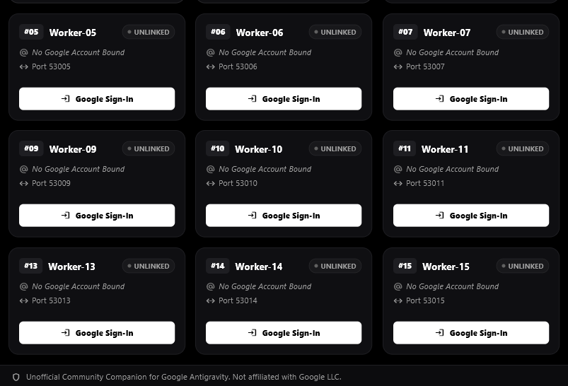
<!-- slide -->
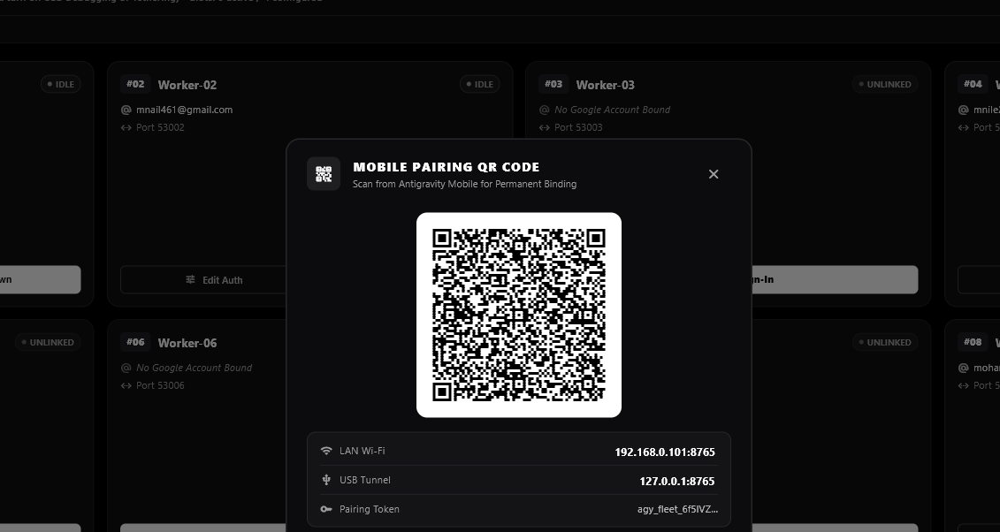
<!-- slide -->
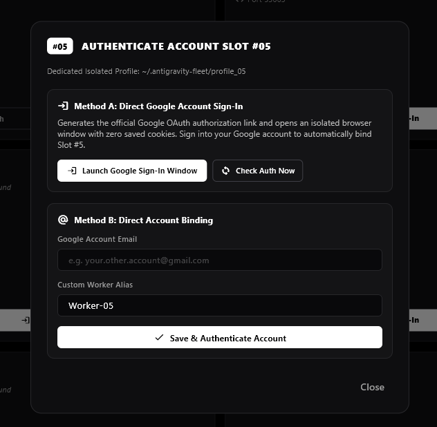
````

---

### 8. Multi-Slot Fleet Routing & Skills Catalog
Control multi-slot worker policies and trigger built-in agent capabilities from phone:
- **Flexible Worker Dispatch**: Choose between Single Dedicated Slot, Quota Pool failover, and 15x Swarm parallel processing.
- **Agent Skills Toggles**: Inspect and enable integrated skills (`agy-customizations`, `antigravity-guide`, `generative_ui`).

````carousel
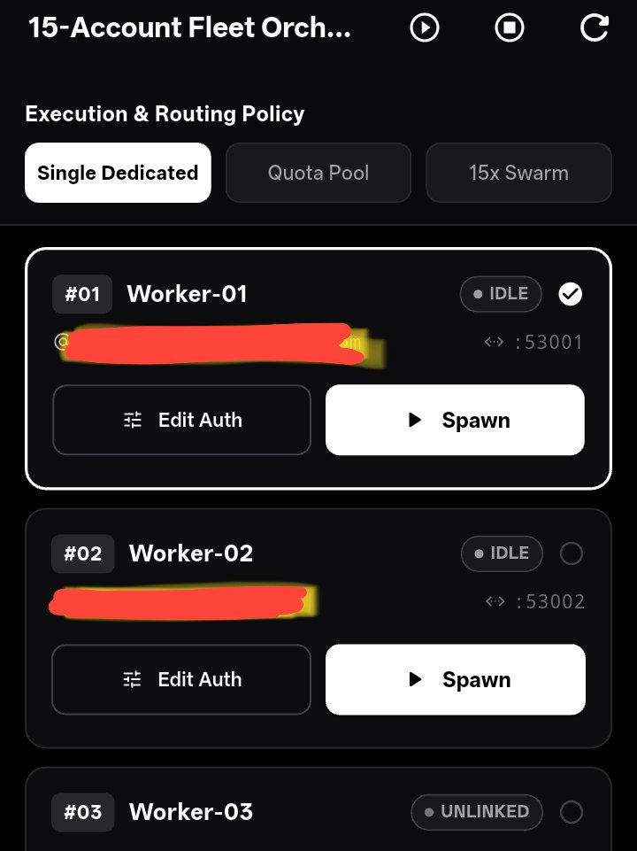
<!-- slide -->
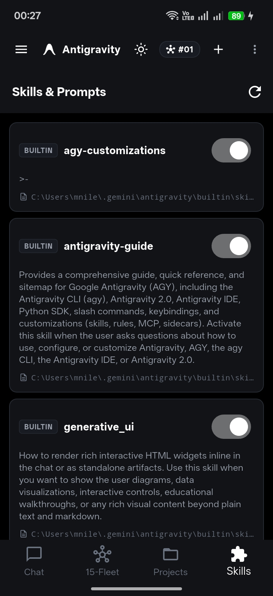
<!-- slide -->
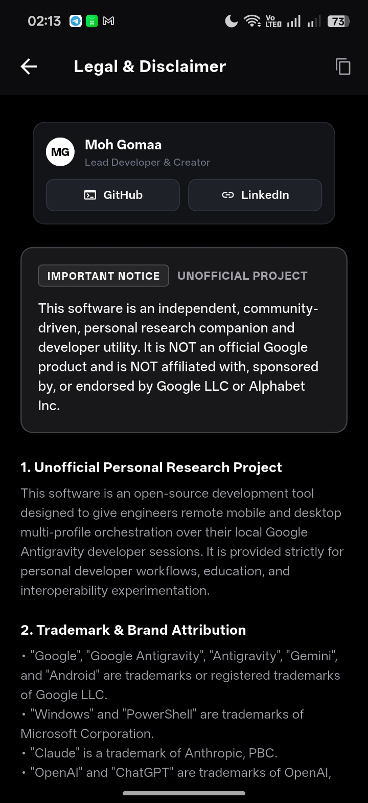
````

---

### 9. Autonomous Auto-Proceed Architecture (Zero-Block)
Eliminates deadlocks and modal freezes when orchestrating development workflows from mobile:
- **No Blocking Tool Modals**: Antigravity is configured with auto-proceed directives across all runtime bridge dispatches, strictly avoiding interactive `ask_question` tool calls that would otherwise freeze the execution loop on the host PC while leaving mobile devices waiting indefinitely.
- **Smart Recommendation Resolution**: If ambiguous architectural choices or multi-choice trade-offs arise, the engine automatically selects the industry-standard recommended option, proceeds immediately with complete implementation, and documents its rationale transparently in the final response.
- **Fail-Safe Client Countdown**: For legacy questions or interactive choice cards, the Android companion displays an automatic 15-second countdown with an instant **"Auto-Proceed (Recommended)"** action button, ensuring sessions never stall even when unattended.

---

## First-Time Setup & Mobile Pairing Guide

### Step 1: Install Windows Fleet Station
Run `Antigravity-FleetStation-Setup-v1.0.4.exe`. Installs self-contained with the bundled Python bridge gateway.

The application includes a self-healing background supervisor that automatically launches the bundled Python bridge gateway on port `8765`.

### Step 2: Install Android Companion App
- Transfer `Antigravity-Mobile-v1.0.4.apk` (or `Antigravity-Mobile-Latest.apk`) to your Android device and install it.
- Accepts Android 8.0 (API 26) through Android 15+.

### Step 3: Pair Mobile App with Windows PC
1. Ensure both your PC and phone are connected to the same local Wi-Fi network (or connect phone via USB).
2. On the PC, open the **Fleet Station** dashboard to display the pairing QR code.
3. On the phone, tap **Scan QR Code** on first boot. The app automatically resolves the host LAN IP and pairing token.
4. *Alternative (USB Debugging / ADB)*: If on an isolated Wi-Fi network, forward the port over USB:
   ```powershell
   adb reverse tcp:8765 tcp:8765
   ```
   Then connect to `http://127.0.0.1:8765` directly.


---

## Security & Privacy Model

| Security Dimension | Technical Mechanism & Implementation |
| :--- | :--- |
| **Local-First Architecture** | No persistent application backend or cloud datastore. History, settings, and workspaces are stored exclusively on the host PC. |
| **Transport Options** | Operates over local Wi-Fi (`192.168.x.x:8765`) or USB reverse tunnel (`adb reverse tcp:8765 tcp:8765`). Optional Cloudflare tunnels serve strictly as an ephemeral transport mechanism. |
| **Token Authentication** | Bridge endpoints enforce dynamic bearer authentication tokens (`x-bridge-token`), validated on every HTTP and WebSocket frame. |
| **Profile Partitioning** | Chromium user directories (`~/.antigravity-fleet/profile_01..15`) isolate session cookies, browser caches, and local databases per account slot. |
| **Runtime Compliance** | Integrates non-invasively with Antigravity via standard Language Server Connect protocol and Named Pipes without modifying upstream binaries. |

---

## Release Downloads (v1.0.4)

| Platform | Package | Description | Size |
| :--- | :--- | :--- | :--- |
| **Windows (Setup Installer)** | [`Antigravity-FleetStation-Setup-v1.0.4.exe`](https://github.com/mohgomaa-art/antigravity-mobile/releases) | Complete setup wizard with auto-firewall & bundled Python bridge | ~114.3 MB |
| **Windows (Portable Standalone)** | [`Antigravity-FleetStation-Portable.zip`](https://github.com/mohgomaa-art/antigravity-mobile/releases) | Zero-install standalone archive — extract anywhere and run immediately | ~226.6 MB |
| **Android (Universal APK)** | [`Antigravity-Mobile-v1.0.4.apk`](https://github.com/mohgomaa-art/antigravity-mobile/releases) | Universal production release APK for Android 8.0 - 15+ | ~69.5 MB |
| **Source Code (Exact Architecture)** | [`Antigravity-SourceCode-v1.0.4.zip`](https://github.com/mohgomaa-art/antigravity-mobile/releases) | Pure source code archive preserving complete directory hierarchy | ~27.6 MB |

> [!TIP]
> Download the latest packaged binaries directly from [**GitHub Releases**](https://github.com/mohgomaa-art/antigravity-mobile/releases). Local compiled copies and direct mirrors (`Latest.exe`, `portable.zip`, `Latest.apk`, `Antigravity-SourceCode-Latest.zip`) are preserved in `D:\Antigravity\APP`.

---

## Building from Source

### Prerequisites
- Python 3.10+
- Flutter SDK 3.24+
- Inno Setup 6 (for Windows installer)
- Android SDK (for APK compilation)

### Build Commands
```powershell
# 1. Compile Standalone Python Bridge
pyinstaller antigravity_bridge.spec -y

# 2. Build Windows Release Binary
cd flutter_app
flutter build windows --release

# 3. Build Android Release APK
flutter build apk --release

# 4. Compile Inno Setup Windows Installer
& "ISCC.exe" ..\installer.iss
```

---

## License

This project is licensed under the **Apache License 2.0** - see the [LICENSE](LICENSE) file for details.
Section 6 explicitly excludes the grant of any trademark rights.
