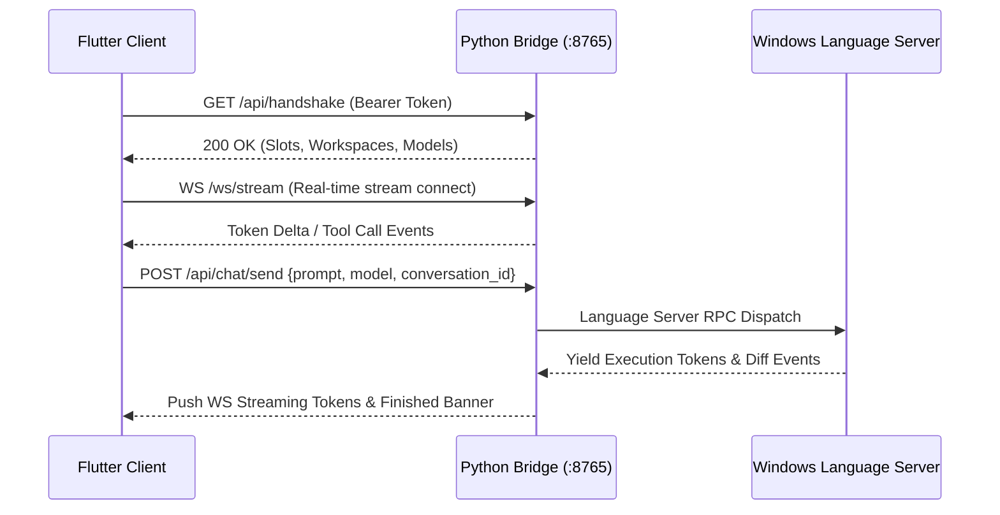

# Antigravity Mobile Companion & Windows Fleet Station (Flutter Client)

[](https://flutter.dev)
[](https://dart.dev)
[](https://riverpod.dev)
[](https://github.com/mohgomaa-art/antigravity-mobile)

This directory contains the production cross-platform Flutter application for the **Antigravity Mobile Companion** (Android) and the **Windows Fleet Command Station** runner.

---

## 1. Architectural Overview

The application is structured into decoupled core layers following clean architectural patterns and reactive state management:

```
flutter_app/
├── lib/
│   ├── core/
│   │   ├── api/
│   │   │   ├── agy_client.dart          # REST API gateway client (Bearer token auth)
│   │   │   └── ws_channel.dart          # WebSocket stream channel for live tokens
│   │   ├── models/
│   │   │   ├── chat_message.dart        # Chat history, tool calls, and diff models
│   │   │   ├── fleet_slot.dart          # Account worker slot definitions
│   │   │   ├── project.dart             # Workspace directories and session models
│   │   │   └── skill.dart               # Agent skills and custom instructions
│   │   ├── services/
│   │   │   └── pairing_service.dart     # QR scanning & ADB tunnel handshake
│   │   └── theme/
│   │       ├── agy_theme.dart           # Monochrome dark UI design tokens
│   │       └── language_icons.dart      # Language-specific code glyph mappings
│   ├── providers/
│   │   ├── chat_provider.dart           # Conversation stream & message state
│   │   ├── fleet_provider.dart          # 15-slot multi-account orchestration
│   │   ├── projects_provider.dart       # Workspace tree, diffs & task isolation
│   │   └── skills_provider.dart         # Agent skills catalog state
│   ├── views/
│   │   ├── chat/                        # Live chat, diff cards, prompt composer
│   │   ├── desktop/                     # Windows Fleet Station dashboard
│   │   ├── fleet/                       # Mobile 15-slot routing policies
│   │   ├── pairing/                     # Station pairing & QR camera scanner
│   │   ├── sidebar/                     # Sleek navigation drawer & project tree
│   │   ├── skills/                      # Skills discovery & toggles
│   │   └── workspaces/                  # File explorer & project management
│   └── main.dart                        # Multi-platform app bootstrap
└── pubspec.yaml                         # Dependencies and build configuration
```

---

## 2. Key Modules & State Management

### 2.1 State Management with Riverpod
All application state is powered by **Flutter Riverpod**:
- **`ChatProvider`**:
  - Manages message streams, real-time token rendering, thinking trace bubbles (`Thought for 12s`), and execution trees.
  - Handles optimistic user prompt bubbles and live stop signals.
- **`ProjectsProvider`**:
  - Manages active workspaces, file exploration, and conversation selection.
  - Enforces strict conversation scoping for background tasks so idle conversations remain clean.
  - Dynamically computes accurate line additions and deletions from backend unified diffs.
- **`FleetProvider`**:
  - Coordinates all 15 account slots, worker lifecycle (`IDLE`, `ACTIVE`, `UNLINKED`), and dispatch routing modes (`Single`, `Quota Pool`, `15x Swarm`).
- **`SkillsProvider`**:
  - Queries local agent skills and custom instructions, allowing real-time activation.

### 2.2 Strict Monochrome Aesthetic (`AgyTheme`)
The client enforces a distraction-free, terminal-grade monochrome visual system:
- **Background**: `#000000` (Pure OLED black) / `#121212` (Surface dark).
- **Cards & Borders**: Subtle borders (`#262626`) and responsive hover states.
- **Accents**: Pure crisp white (`#FFFFFF`) text with muted gray subtitles (`#8E8E93`).
- **Diff Highlights**: Exact terminal green (`#10B981`) for additions and red (`#EF4444`) for deletions.

---

## 3. Communication Protocols



---

## 4. Development & Build Commands

### Prerequisites
- Flutter SDK `^3.24.0`
- Dart SDK `^3.5.0`
- Android Studio / Android SDK (for Android build)
- Visual Studio 2022 with "Desktop development with C++" (for Windows build)

### 4.1 Running in Development Mode

```bash
# Get dependencies
flutter pub get

# Run on connected Android device via ADB
flutter run -d <device_id>

# Run on Windows Desktop
flutter run -d windows
```

### 4.2 Building Production Release Deliverables

```bash
# 1. Compile Android Universal Release APK
flutter build apk --release
# Output: build/app/outputs/flutter-apk/app-release.apk

# 2. Compile Windows Native Release Bundle
flutter build windows --release
# Output: build/windows/x64/runner/Release/
```

### 4.3 High-Speed USB Debugging with ADB

If testing over USB without Wi-Fi routing:
```powershell
# Forward the Python Bridge port directly to the Android handset
adb reverse tcp:8765 tcp:8765

# Launch the app and connect to http://127.0.0.1:8765
```

---

## 5. Automated Testing & Code Quality

```bash
# Run static analysis (0 errors guaranteed)
flutter analyze

# Run unit and widget tests
flutter test
```

---

## 6. License & Attribution

Licensed under the **Apache License 2.0**.
See root [LICENSE](../LICENSE) and [DISCLAIMER.md](../DISCLAIMER.md) for full trademark attributions and terms of use.
